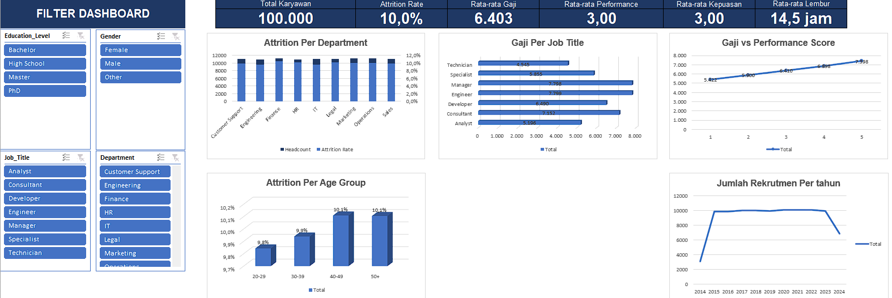
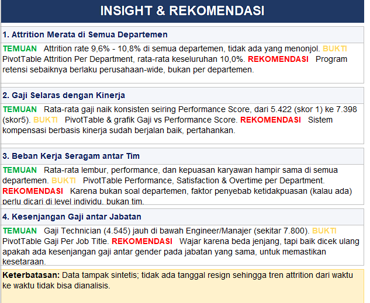

# Employee Performance & Productivity Analysis

An Excel-based HR analytics project that cleans, analyzes, and visualizes a dataset of 100,000 employees to support HR decision-making on attrition, compensation, and performance.

## Dashboard

## Objective

Analyze attrition, salary, and performance patterns to identify where HR should focus its retention and compensation efforts.

## Dataset

- 100,000 employee records with 20 original columns (department, job title, salary, performance score, overtime, satisfaction, resignation status, etc.)
- 7 columns derived during analysis (e.g., Attrition_Flag, Age_Group, Tenure_Band, Salary_Band)
- ⚠️ The data appears to be **synthetic (dummy data)** and contains no real employee information. It has no resignation date, so attrition trends over time cannot be analyzed.

## Process

1. **Data cleaning:** trimmed text, converted text to numbers, converted Hire_Date to date format, and checked for duplicates
2. **Feature creation:** built grouping columns such as age group, tenure band, and salary band
3. **Analysis:** built PivotTables and PivotCharts
4. **Dashboard:** KPI cards, charts, and slicers for interactive filtering
5. **Insights:** summarized findings with recommendations

## Insights & Recommendations

## Key Findings

| # | Finding | Recommendation |
|---|---------|----------------|
| 1 | Attrition is even across departments, ranging from 9.6% to 10.5% (overall 10.0%) | Run retention programs company-wide rather than per department |
| 2 | Average salary rises consistently with performance score, from 5,422 (score 1) to 7,398 (score 5) | The performance-based pay system works well; keep it |
| 3 | Overtime, performance, and satisfaction are nearly identical across departments | Look for causes of dissatisfaction at the individual level, not the team level |
| 4 | Technicians earn far less (4,545) than Engineers and Managers (about 7,800) | Review whether pay gaps exist between genders within the same job title |

## Workbook Structure

| Sheet | Content |
|-------|---------|
| Cover | Project overview and table of contents |
| Dashboard | KPIs and interactive charts |
| Insight | Findings and recommendations |
| Analysis | PivotTables |
| Data_Dictionary | Column descriptions |
| Clean_Data | Analysis-ready data |
| Raw_Data | Original data |

## Tools

Microsoft Excel: PivotTable, PivotChart, Slicer, Conditional Formatting, formulas

## How to Open

[Download Employee_Performance_Analysis.xlsb](https://github.com/Aulia-Akbar/employee-performance-analysis/raw/main/Employee_Performance_Analysis.xlsb) and open it in Microsoft Excel. The file uses the Excel Binary format (.xlsb) to stay under GitHub's file size limit.

## Author

**Hikmal Aulia Akbar**
[LinkedIn](https://www.linkedin.com/in/hikmal-aulia-akbar-a31373314) · [Email](mailto:hikmalgood56@gmail.com)
